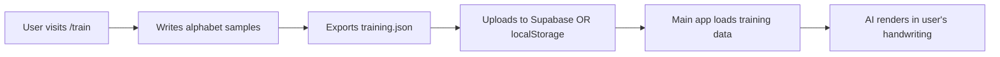

# Architecture Decision: Separate Training Tool

**Date:** 2025-11-16
**Decision:** Move handwriting training to a separate tool/script

---

## 🎯 Problem

Current implementation has training mode in the main app:
- ❌ Clutters main UI with rarely-used features
- ❌ Most users won't have trained handwriting on first use
- ❌ Training is a one-time setup, not a core workflow
- ❌ Adds complexity to main app

---

## ✅ Solution

### Main App (`npm run dev`)
**Purpose:** Simple AI notebook for writing and conversation

**Features:**
- Text input (keyboard)
- AI conversation
- Export to PDF/JSON
- **No drawing tools** (or minimal, text-only)

**Default Behavior:**
```
User types: "What's 2+2?"
AI responds: "4" (in simulated handwriting OR plain text)
```

### Training Tool (`npm run train`)
**Purpose:** One-time handwriting model setup

**Features:**
- Typography guides
- Alphabet prompts
- Sample collection
- Export training data

**Workflow:**
```bash
# Run training once
npm run train

# Opens localhost:3000/train
# User writes alphabet (a-z, A-Z, 0-9)
# Exports training data to JSON
# Main app loads this data for AI responses
```

---

## 📁 Proposed Structure

### New Pages:

```
app/
├── page.tsx          # Main app (text input + AI chat)
├── train/
│   └── page.tsx      # Training tool (alphabet practice)
└── api/
    └── claude/
        └── route.ts  # AI endpoint
```

### Scripts:

```json
{
  "scripts": {
    "dev": "next dev",              // Main app
    "train": "next dev --port 3001", // Training on different port (optional)
    "build": "next build",
    "start": "next start"
  }
}
```

---

## 🎨 Main App UI Changes

### Remove from Toolbar:
- ❌ "Train AI" button
- ❌ Typography guides toggle
- ❌ Training status bar

### Keep in Toolbar:
- ✅ Sign In/User Menu
- ✅ New Session
- ✅ Export (PDF/JSON)
- ✅ Theme toggle

### Simplify Input:
```typescript
// Default: Text input (textarea or contentEditable)
<textarea
  placeholder="Ask me anything..."
  onChange={(e) => sendToAI(e.target.value)}
/>

// OR: Simple drawing (if trained model exists)
<Canvas
  mode="text-only"  // No pressure sensitivity, just basic lines
/>
```

---

## 🎓 Training Tool (`/train`)

### Dedicated Training Page

```typescript
// app/train/page.tsx
export default function TrainingPage() {
  return (
    <div className="h-screen flex flex-col">
      <header>
        <h1>Handwriting Training</h1>
        <p>Teach Cursive to write like you</p>
      </header>

      <main className="flex-1">
        <TrainingCanvas />
        <TrainingProgress />
      </main>

      <footer>
        <button onClick={exportTrainingData}>
          Export Training Data
        </button>
      </footer>
    </div>
  );
}
```

### URL Structure:
- `/` - Main app (chat/conversation)
- `/train` - Training tool (one-time setup)
- `/settings` - User settings (API keys, billing, etc.)

---

## 🔄 Migration Path

### Phase 1: Move Training to Separate Page (1 hour)
- [ ] Create `app/train/page.tsx`
- [ ] Move training UI components there
- [ ] Remove training buttons from main Toolbar
- [ ] Add link in Settings: "Train Handwriting Model"

### Phase 2: Simplify Main App (30 min)
- [ ] Remove typography guides from Canvas
- [ ] Remove training mode state from useCanvas
- [ ] Simplify main UI to text input only

### Phase 3: Add Training Data Loader (30 min)
- [ ] Create `lib/training-loader.ts`
- [ ] Load training data from localStorage or API
- [ ] Use for AI response rendering

---

## 💾 Training Data Flow



### Storage Options:

**Option 1: LocalStorage (Simple)**
```typescript
// After training
localStorage.setItem('cursive-training-data', JSON.stringify(trainingData));

// In main app
const trainingData = JSON.parse(localStorage.getItem('cursive-training-data') || 'null');
```

**Option 2: Supabase (Multi-device sync)**
```typescript
// After training
await supabase
  .from('training_data')
  .insert({ user_id, training_data: trainingData });

// In main app
const { data } = await supabase
  .from('training_data')
  .select('training_data')
  .eq('user_id', userId)
  .single();
```

---

## 🎯 Benefits of This Approach

### For Users:
✅ **Simpler main app** - Just text and AI, no clutter
✅ **Faster first-time experience** - No training required to start
✅ **Optional advanced feature** - Train handwriting if you want
✅ **Clear separation** - Training is deliberate, one-time setup

### For Developers:
✅ **Cleaner code** - Main app has less complexity
✅ **Easier testing** - Training isolated in its own page
✅ **Better UX** - Each page has single, clear purpose
✅ **Scalable** - Can add more training modes (signatures, diagrams, etc.)

---

## 📋 Implementation Checklist

### Immediate (Next Steps):
- [ ] Create `/train` page
- [ ] Move TrainingCanvas component
- [ ] Add "Train Handwriting" link in user menu
- [ ] Test training workflow in isolation

### Follow-up:
- [ ] Remove training state from main useCanvas hook
- [ ] Simplify main app UI
- [ ] Add training data loader
- [ ] Update documentation

### Future Enhancements:
- [ ] Multiple training styles (casual, formal, signatures)
- [ ] Training progress persistence (save partial progress)
- [ ] Share training data (export/import for different devices)
- [ ] Cloud sync for training models

---

## 🚀 Quick Start (After Migration)

### For New Users:
```bash
1. npm run dev
2. Visit localhost:3000
3. Type "Hello!" and get AI response
4. (Optional) Visit /train to set up handwriting
```

### For Training:
```bash
1. Visit localhost:3000/train
2. Follow alphabet prompts
3. Export training data
4. Return to main app
5. AI now writes in your style!
```

---

## 📊 Comparison

### Before (Current):
```
Main App:
- Text input
- Drawing tools
- Training mode toggle
- Typography guides
- Training progress bar
- Canvas complexity: HIGH
```

### After (Proposed):
```
Main App (/):
- Text input ONLY
- Clean, simple UI
- Canvas complexity: LOW

Training Tool (/train):
- All training features
- Typography guides
- Progress tracking
- Export data
```

---

**Decision:** ✅ Approved - Moving training to `/train` page for cleaner architecture
